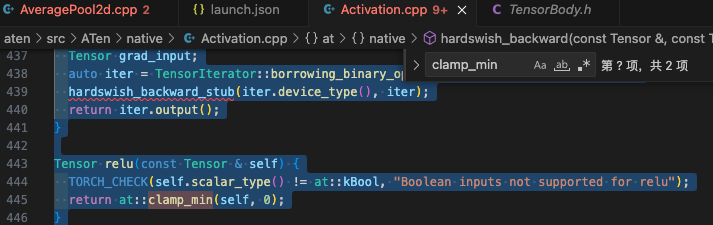

### C++ Debug PyTorch code using VSCode.

1. Add VS code debug configure file in PyToch folder:

    ```json
    {
        // Use IntelliSense to learn about possible attributes.
        // Hover to view descriptions of existing attributes.
        // For more information, visit: https://go.microsoft.com/fwlink/?linkid=830387
        "version": "0.2.0",
        "configurations": [
            {
                "type": "cppdbg",
                "request": "attach",
                "name": "PytorchAttach",
                "processId": "${command:pickProcess}",
                "program": "/usr/bin/python",
                "MIMode": "gdb",
                "setupCommands": [
                    {
                        "description": "Enable pretty-printing for gdb",
                        "text": "-enable-pretty-printing",
                        "ignoreFailures": true
                    }
                ]
            },
            {
                "name": "Python: Current file",
                "type": "python",
                "request": "launch",
                "program": "${file}",
                "console": "integratedTerminal",
                "justMyCode": false
            }
        ]
    }

    ```
2. Add pdb breakpoint in your code and get the PID number:

    ```python
    import torch
    import pdb
    import os
    print(os.getpid())

    pdb.set_trace()
    a=torch.randn(2, 3)

    y = torch.relu(a)
    ```

    For this example, we use torch.relu, we can add a C++ breakpoint at 
    
    

    Then run your code and attach your print PID number to debugging.

### Debug python script in bash script using VS code.

1. First, you need to modify your Python script to wait for the debugger to attach. You can do this by adding the following code to the beginning of your script:

    ```python
    import debugpy
    # Allow other computers to attach to debugpy at this IP address and port.
    debugpy.listen(('localhost', 5678))
    # Pause the program until a remote debugger is attached
    debugpy.wait_for_client()
    ```

2. Next, you need to add a new launch.json configuration in VSCode that tells the debugger to attach to the local process:

    ```json
    {
        "version": "0.2.0",
        "configurations": [
            {
                "name": "Python: Attach",
                "type": "python",
                "request": "attach",
                "port": 5678,
                "host": "localhost"
            }
        ]
    }
    ```

3. Launch your bash script from the terminal like you usually would. The Python script will run and then pause execution waiting for the debugger to attach.

4. Start the  debugger in VSCode using the "Python: Attach" configuration. The debugger will attach to the Python process, and you'll be able to debug your Python script as you normally would inside VSCode.
